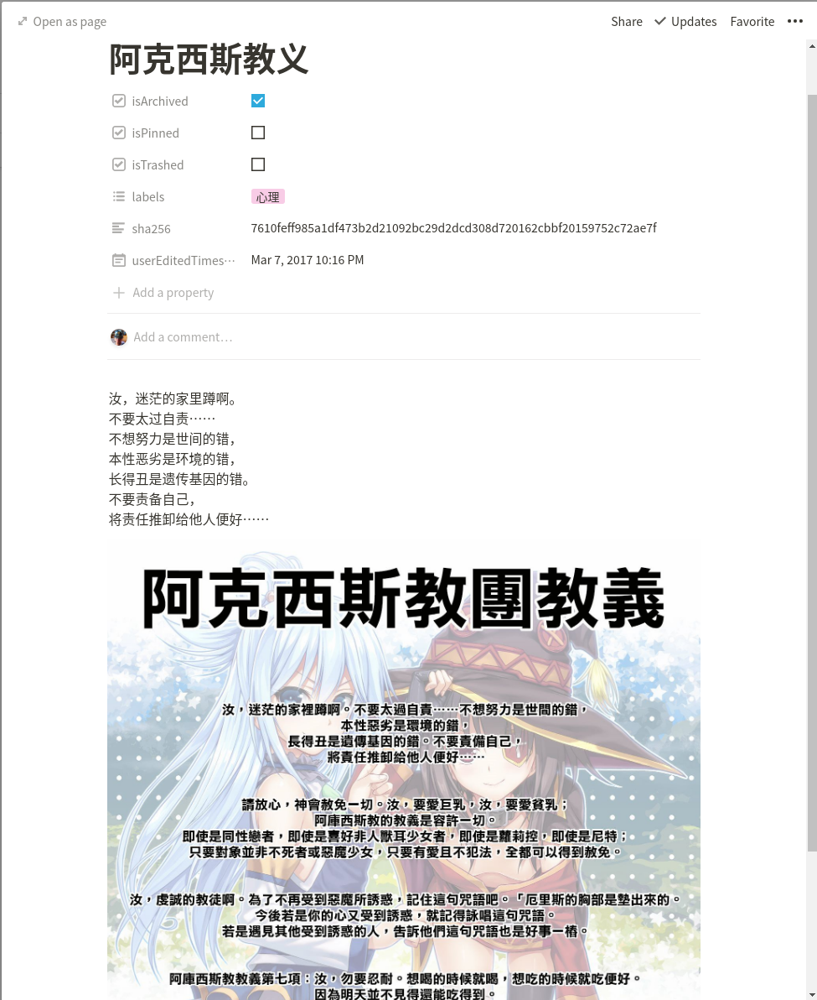

# NotionImportKeep

使用notion非官方python api上传google keep笔记到notion,


### 运行说明

1. 先安装notion依赖的setuptools否则安装notion会报错，
1. 安装依赖的非官方api库notion, 指定版本是因为作者更新了自动重连支持却没更新仓库包(2021.1.27)，
1. 使用python3运行脚本main.py,

```shell
pip3 install setuptools
pip3 install git+git://github.com/jamalex/notion-py.git@ce7c6e4d8669e49b581efd7345e2f5d624841184
python3 main.py
```

### 使用步骤

1. 先上takeout导出google keep，用到的格式是json,导出后下载解压，
1. 运行脚本，
1. 输入notion网站上的键为token_v2的cookies值，
1. 输入导出的keep所在路径，需要包含json的文件夹完整路径，
1. 输入导入目的notion数据库block的id，留空直接回车表示由脚本自动在根节点创建数据库，

### 注意

1. ~~导入过程很容易因为网络问题停止，~~
1. 所以支持指定block id，用于断点续传，
1. 指定同一个block导入时会自动跳过已经上传了的记事，
1. ~~线程越多越容易出现莫名卡住不走，~~
1. 不支持多进程，
1. 没有标题的记事会复制或剪切正文前30字到标题，
1. 如果包含多种类型的内容，统一按照以下顺序排列，不存在的跳过，对不上的清空后续内容，
   1. 文本， textContent
   1. 附件， attachments
   1. 多选框， listContent

### 不打算支持

1. 记事颜色，notion不支持，导入成属性也没啥意义，
1. 富媒体链接，正常这链接地址肯定包含在正文里，没必要再来个富媒体链接，
1. 提醒，目前提醒会当成普通记事被导入，这就够了，keep都不用了应该也不需要keep上的提醒了吧，

### 也许会支持

1. 收尾删除空白记事，
1. 添加每个label为一个view,

### 感谢

[https://github.com/jamalex/notion-py](https://github.com/jamalex/notion-py)
